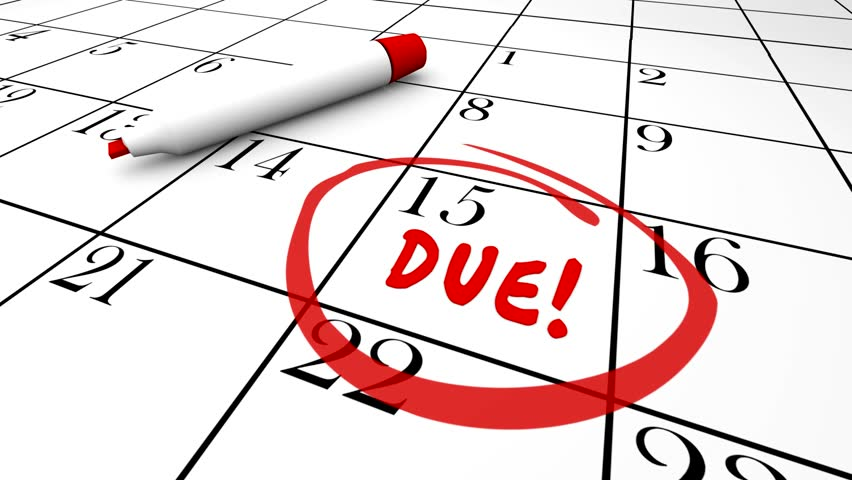

<h1 style="color:green; text-align: center">Subscription Tracker</h1>

---

## Welcome to Subscription Tracker! 
This app is designed to keep tracker of your free and paid subscriptions such as Netflix, Amazon, Spotify, and more. As the renewal dat for your subscription comes close, or your free trial is about to end, this app will alert you. By default, notifications will be issues 7 days in advance of the renewal date. This will give you one week to either cancel your subscription, end your free trial, or be prepared to pay for the renewal.

# App Structure
## ERD

### Domain Model (ERD)

 

## Module Structures

  

## Outline
* MVP
  * Users
  * Subscriptions
  * Services
  * Reminders

* Log In
  * Create New User
    * Validation of Password
    * Adding First Subscription
    * Creating Reminder
    * Creating Calendar Event

  * Existing User (jsmith)
    * Reminder Pop-up
    * Update Subscription
    * Change User Settings
      * Username (Validation)
      * Budget
    * Spending Analyzer

  * Known Issues/Futures Goals
    * Renew Subs & Auto-renew
    * Scraping Service Info & Plan options
      * Support for adding new services & features
