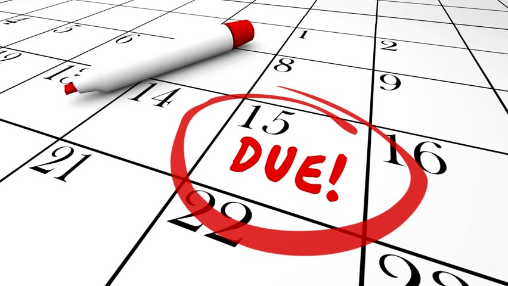
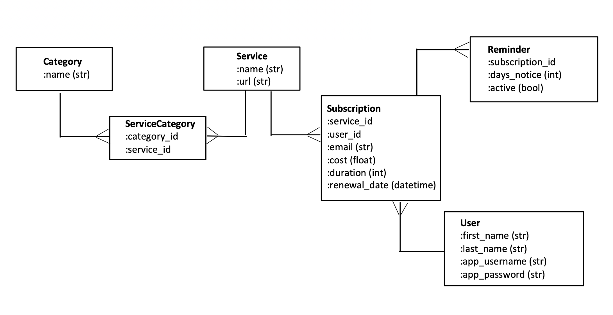

<h1 style="color:green; text-align: center">Subscription Tracker</h1>

---

## Welcome to Subscription Tracker! 
This app is designed to keep tracker of your free and paid subscriptions such as Netflix, Amazon, Spotify, and more. As the renewal dat for your subscription comes close, or your free trial is about to end, this app will alert you. By default, notifications will be issues 7 days in advance of the renewal date. This will give you one week to either cancel your subscription, end your free trial, or be prepared to pay for the renewal.

---
## Table of Contents
- [Welcome to Subscription Tracker!](#welcome-to-subscription-tracker)
- [Table of Contents](#table-of-contents)
- [1. Using the App](#1-using-the-app)
  - [1.1 Launching the App](#11-launching-the-app)
  - [1.2 Logging In](#12-logging-in)
    - [1.2.1 New Users](#121-new-users)
    - [1.2.2 Existing Users](#122-existing-users)
  - [1.3 App Features](#13-app-features)
    - [1.3.1 My Subscriptions](#131-my-subscriptions)
      - [1.3.1.1 Viewing Subscriptions](#1311-viewing-subscriptions)
      - [1.3.1.2 Adding New Subscriptions](#1312-adding-new-subscriptions)
      - [1.3.1.3 Update Subscription](#1313-update-subscription)
      - [1.3.1.4 Delete Subscription](#1314-delete-subscription)
      - [1.3.1.5 Access Reminders](#1315-access-reminders)
    - [1.3.2 Spending Analyzer](#132-spending-analyzer)
    - [1.3.3 Reminders](#133-reminders)
      - [1.3.3.1 Change Days Notice](#1331-change-days-notice)
      - [1.3.3.2 Disable Reminder](#1332-disable-reminder)
    - [1.3.4 User Settings](#134-user-settings)
      - [1.3.4.1 Change SubscriptionTracker Username](#1341-change-subscriptiontracker-username)
      - [1.3.4.2 Change SubscriptionTracker Password](#1342-change-subscriptiontracker-password)
      - [1.3.4.4 Delete SubscriptionTracker Account](#1344-delete-subscriptiontracker-account)
- [2. App Design](#2-app-design)
  - [2.1 Domain Model (ERD)](#21-domain-model-erd)
  - [2.2 Model Associations](#22-model-associations)
  - [2.3 Interface Modules](#23-interface-modules)
  - [2.4 MVP](#24-mvp)
    - [2.4.1 User](#241-user)
    - [2.4.2 Subscription](#242-subscription)
    - [2.4.3 Service](#243-service)
    - [2.4.4 Reminder](#244-reminder)
    - [2.4.5 Seeds](#245-seeds)
    - [2.4.6 CLI](#246-cli)
  - [2.5 Stetch Goals](#25-stetch-goals)
    - [2.5.1 README in Markdown](#251-readme-in-markdown)
    - [2.5.2 User Login System](#252-user-login-system)
    - [2.5.3 Modularize Main App](#253-modularize-main-app)
    - [2.5.4 Reminders link to User's Calendar App](#254-reminders-link-to-users-calendar-app)
---
## 1. Using the App
### 1.1 Launching the App
To launch the app, navigate to the parent directory.

Use the rake command `rake start` in the terminal to launch the app.

### 1.2 Logging In
#### 1.2.1 New Users
If you have not previously made an account with SubscriptionTracker, select <strong>New User</strong> from the main menu.
* The app will ask you for your first and last name, as well as a username and password in order to create an account.
* If the username you have selected is already in use, you will be prompted to pick a new username

#### 1.2.2 Existing Users
If you have previously made an account with Subscriptiontracker, enter the username and password that you selected when you made the account.

[[Top]](#table-of-contents)

### 1.3 App Features
Use the main menu to navigate through the app. The major features are described individualy below.

#### 1.3.1 My Subscriptions
##### 1.3.1.1 Viewing Subscriptions
If you have already added subscriptions to you SubscriptionTracker account, selecting <strong>My Subscriptions</strong> will display a menu of all of your current subscriptions and the subscription details such as cost, duration, and renewal date. 
* Pressing `enter` on any of the current subscriptions will select that subscription and allow you to:
  * [Update the subscription](#1313-update-subscription) details such as cost or plan duration.
  * Set up or modify the [reminder](#132-reminders) for this subscription.
* Below the list of subscriptions, or if you have not already added some, you will see an option to [add a new subscription](#1312-adding-new-subscriptions).

[[Top]](#table-of-contents)
##### 1.3.1.2 Adding New Subscriptions
Selecting this option will allow you to add a new subscription to your SubscriptionTracker account.
* A list of subscription services currently linked to this app will be displayed in a menu. Select the service which you are subscribed to in order to begin tracking it in the app.
  * Hint: Begin typing the first few letters of the service name in order to filter the list.
* Upon selecting a service, you will need to enter all of the following in order to track the subscription on the app:
  * <strong>Email Address:</strong> Enter the email address that you used to create the subscription. If you have multiple accounts or subscriptions to the same service, be sure to use the correct email address for each subscription you are associating with your SubscriptionTracker account.
  * <strong>Subscription Duration:</strong> Enter the duration of the subscription plan in days.
    * For a recurring 1 month subscription, enter `30`
    * For a recurring 3 month subscription, enter `90`
    * For a recurring 1 year subscription, enter `365`
  * <strong>Cost of Subscription:</strong> Enter the cost of the subscription per the recurring duration. For example, if you have a monthly plan, enter the monthly cost. If you have an annual plan, enter the annual cost.
    * The cost <strong>must</strong> be entered in standard monetary format, without the dollar sign.
      * Ex: $5 should be entered as 5.00
* After successfully adding a new subscription to your SubscriptionTracker Account, it will automatically give you the option to [setup a new reminder](#132-reminders)

[[Top]](#table-of-contents)

##### 1.3.1.3 Update Subscription
After selecting a current subsction, choose <strong>Update/Delete Subscription</strong> from the subscription menu.
* In order to update the details of your subscription plan such as cost or plan duration, select <strong>Update cost/duration</strong> from the next menu
* When updating the plan details, ensure to follow all of the same guidelines for entering the cost and plan duration that you followed when initially creating the subscription. Those details are listed below again for your convenience.
  * <strong>Subscription Duration:</strong> Enter the duration of the subscription plan in days.
    * For a recurring 1 month subscription, enter `30`
    * For a recurring 3 month subscription, enter `90`
    * For a recurring 1 year subscription, enter `365`
  * <strong>Cost of Subscription:</strong> Enter the cost of the subscription per the recurring duration. For example, if you have a monthly plan, enter the monthly cost. If you have an annual plan, enter the annual cost.
    * The cost <strong>must</strong> be entered in standard monetary format, without the dollar sign.
      * Ex: $5 should be entered as 5.00

[[Top]](#table-of-contents)

##### 1.3.1.4 Delete Subscription
After selecting a current subscription, choose <strong>Update/Delete Subscription</strong> from the subscription menu.
* In order to delete a subscription plan from your SubscriptionTracker app acount, select <strong>Delete Subscription</strong> from the next menu.
  * :warning: Warning: Deleting a subscription is irreversible. :warning: 

[[Top]](#table-of-contents)

##### 1.3.1.5 Access Reminders
Selecting <strong>Access Reminder</strong> from the subscription menu will display the date on which the reminder for that subscription will be displayed upon logging in to SubscriptionTracker. 
* If no reminder has yet been set, you will be asked if you would like to create a new one.
* After creating a new reminder, you will have the option to add this rmeinder to your Calendar app so that the reminder can be tracked outside of SubscriptionTracker.
  * If selected, a Calendar event file will be created with the name `<service_name>.ics `. After this file is created, it will automatically be opened using your default Calendar application.
    * Follow the on-screen directions in the Calendar app to finish adding the even into the Calender.

* Once a reminder exists, you will have the option to adjust how much advance notice the reminder provides, or to disable the reminder from appearing in SubscriptionTracker.

More information on Reminders can be found at [1.3.3 Reminders](#133-reminders)

[[Top]](#table-of-contents)

#### 1.3.2 Spending Analyzer
Selecting this menu option will provide an analysis of your current spending based upon the <strong>current</strong> costs of your subscriptions as well as the durations for each of your subscriptions
* Daily spending report presents a normalized report for the cost of the users current subscriptions per day
  * This is helpful for comparison to common daily expenditures such as a coffee or buying lunch out.
* Monthly spending report assumes that all current subscriptions will be maintained for at least 30 days
* Yearly spending report assumes that all current subscriptions will be maintained for 365 days
* Cost by category will present your will a breakdown of how much the user spends on each of the categories that their services belong to. Please note that some services belong to multiple categories so the total spending of all of your categories may appear higher than your actual recurring payments. Use this to look for areas in which you many be overspending.

[[Top]](#table-of-contents)

#### 1.3.3 Reminders
##### 1.3.3.1 Change Days Notice
Here you can change how many days prior to a subscription expiration that its reminder appears in the SubscriptionTracker app welcome screen.
* Enter the number of <strong>days</strong> notice you would like.date for your subscription is scheduled.
  * For example, if your subscription is set to renew on Jan 20, a 7 day advance notice means that a reminder will be set for Jan 13.
  * After adjusting the reminder you will be given the option to create a new calendar event, similar to when the reminder was first created.
    * While SubscriptionTracker can create new Calendar events, it cannot remove events from your Calendar app. Please remember to delete the old reminder from your Calendar app.

[[Top]](#table-of-contents)

##### 1.3.3.2 Disable Reminder
Selecting this option will allow you to disable the current reminder for a subscription from appearing in the SubsscriptionTracker welcome screen.

* :warning: Warning: Deleting a subscription is irreversible. :warning: 
  * If you would like to re-enable a reminder, you must [create a new one](#1315-access-reminders).
* <strong>SubscriptionTracker cannot remove events from your Calendar app.</strong> Please remember to delete the old reminder from your Calendar app.

[[Top]](#table-of-contents)

#### 1.3.4 User Settings
##### 1.3.4.1 Change SubscriptionTracker Username
This will allow you to change the username that you use to log in to the SubscriptionTracker application. Please note that this does not change the username for your subscription services.
##### 1.3.4.2 Change SubscriptionTracker Password
This will allow you to change the password which you use to log in to the SubscriptionTracker application. Please note that this does not change the password for any of your subscription services.
##### 1.3.4.4 Delete SubscriptionTracker Account
Selecting this option will allow you to <strong>permanently</strong> delete your user account from SubscriptionTracker. This will delete your account, your subscriptions, and any Calendar Event files that you created for your reminders while using SubscriptionTracker.

[[Top]](#table-of-contents)

## 2. App Design
### 2.1 Domain Model (ERD)

[[Top]](#table-of-contents)
### 2.2 Model Associations
* A Category 
  * has many ServiceCategories
  * has many Services through ServiceCategories
* A ServiceCategory
  * belongs to a Category
  * belongs to a Service
* A Service
  * has many ServiceCategories
  * has many Categories through ServiceCategories
  * has many Subscriptions
  * has many Reminders through Subscriptions
  * has many users through subscriptions
* A Subscription
  * belongs to a Service
  * belongs to a User
  * has many Reminders
* A Reminder
  * belongs to Subscription
* A User
  * has many Reminders
  * has many Subscriptions
  * has many Service through Subscriptions

[[Top]](#table-of-contents)

### 2.3 Interface Modules
The main features and menus of the SubscriptionTracker Interface are modularized to facilitate navigation, maintenance, and expansion. In order for the module associations to function, the modules are required using the heirarchy shown below:

[[Top]](#table-of-contents)

### 2.4 MVP
#### 2.4.1 User
User will be able to:
* :white_check_mark: Create a new subscription for themselves 
* :white_check_mark: View their current subscriptions
* :white_check_mark: Modify their current subscription (cost/duration)
* :white_check_mark: Delete their subscription(s)
* :white_check_mark: View subscription spending:
  * By day
  * By month
  * By year
  * By category
  * By most expensive service

[[Top]](#table-of-contents)

#### 2.4.2 Subscription
Subscriptions will be able to:
* :white_check_mark: Initialize a renewal date based on date created and plan duration
* :white_check_mark: Update renewal dates when plan details change
* :white_check_mark: Display subscription information
* :white_check_mark: Calculate days remaining in the current plan
* :white_check_mark: Determine if there is a current active reminder
* :white_check_mark: Find ts active reminder
* :white_check_mark: Create a new reminder (which disables the previous one if it was active)
* :white_check_mark: Calculate a normalized cost (dollar per day)

[[Top]](#table-of-contents)

#### 2.4.3 Service
Services will be able to: 
* :white_check_mark: Associate with new or multiple categories

[[Top]](#table-of-contents)

#### 2.4.4 Reminder
Reminders will be able to:
* :white_check_mark: Initialize with a default notice time of 7 days
* :white_check_mark: Find the date on which the reminder should be issues based on `:days_notice` and its subscription's renewal date

[[Top]](#table-of-contents)

#### 2.4.5 Seeds
* :white_check_mark: Develop comprehensive seed data for app creation to test various aggregate methods and associations.
* :white_check_mark: Multiple scenarios accounted for such as:
  * Users with no subscriptions
  * Users with multiple subscriptions to the same service
  * Free trials vs. paid subscriptions
  * Active reminders, old reminders, no reminders

[[Top]](#table-of-contents)

#### 2.4.6 CLI
* :white_check_mark: Develop basic command line interface for user to manage & control app

[[Top]](#table-of-contents)

### 2.5 Stetch Goals
#### 2.5.1 README in Markdown 
Status: :white_check_mark:
You are reading it :smiley:

#### 2.5.2 User Login System
Status: :white_check_mark:
* Develop system to track app users by username and password to persist subscription information between sessions (See [1.2 Logging In](#12-logging-in))
* Validation system developed to ensure no duplicate usernames are created by multiple users
* Validation system developed to ensure masked passwords match prior to account creation
* User has the ability to delete their app account and data

[[Top]](#table-of-contents)

#### 2.5.3 Modularize Main App
Status: :white_check_mark:
* SubscriptionTracker.rb refactored to that main menu options and features exist in their own modules.
* Modules are associated using heirarchy from children up through parents in order to module inclusion to be complete. (See [2.3 Interface Modules](#23-interface-modules))

[[Top]](#table-of-contents)

#### 2.5.4 Reminders link to User's Calendar App 
Status: :white_check_mark:

* Upon Reminder creation, user is prompted to create a Calendar Event for their machines local calendar app such as iCalendar, Outlook, or Google Calendar.
* The Ruby Gem `icalendar` is used to turn a hash of subscription/reminder information into an event instance.
* This event instance is published to a string formatted for an `.ics` file using the gem's `.to_ical` function
* If it doesn't already exist, Ruby's `Dir` object methods are used to create a directory for the user in `./reminder_files/<app_username>`
* Ruby's `File` class methods are then used to:
  * `open` a new `.ics` file
  * `write` the event information string to the file
  * `open` the `.ics` file for the user to confirm its addition to their Calendar app.

[[Top]](#table-of-contents)

#### 2.5.5 Bring the Terminal to Life
* :white_check_mark: Use `colorize` to color and format CLI output
* :white_check_mark: Use `TTY-Table` to create display tables for spending data
* :white_check_mark: Use ASCII art to create welcome logo and menu graphics
* Animate the welcome menu 

<h1>To Do?</h1>

* Specify Subscription Start Date
* Animate Logo
* Mario Coin sound effect
* update service urls
* build more services